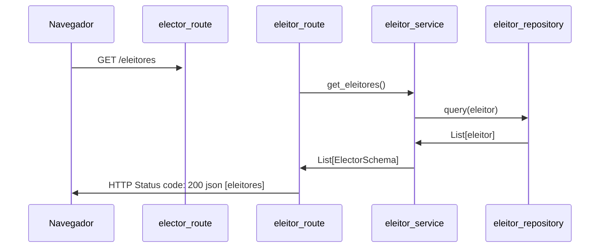
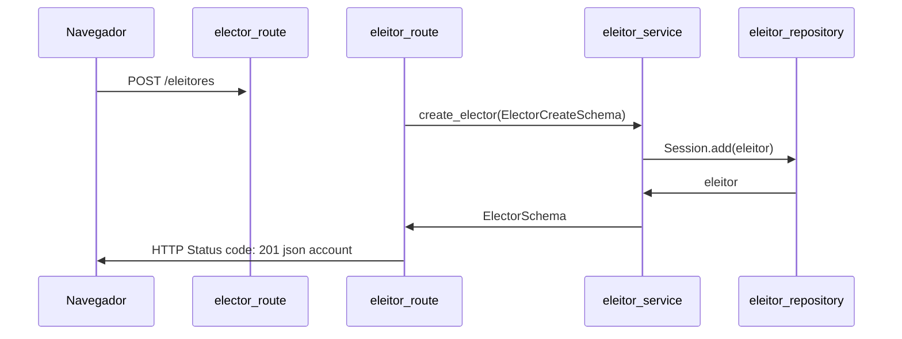

# COUNCILMAN_OFFICE (Gabinete On-Line de Vereador)

## Configurando o projeto
Caso você esteja em um ambiente local execute os passos abaixo dentro da pasta do projeto no terminal do vscode
#### 1) Instalar o ambiente virtual
```bash 
pip3 install virtualenv
```
#### 2) Verifique a versão do virtualenv
```bash
virtualenv --version
```
#### 3) Crie um ambiente virtual
```bash
python -m virtualenv venv
```
#### 4) Ativar o ambiente virtual
no "Linux", use o comando:
```bash
source venv/bin/activate
```
no "Windows", use o comando:
```bash
source venv/Scripts/activate
```

### 5) Para rodar o servidor no terminal

```bash
pip install -r requirements.txt
```

### 6) Para rodar o servidor no terminal

```bash
python app/main.py
```

## Iniciando e terminando o docker-compose

### Iniciando o compose 
```sh
docker-compose up --build

```
### Terminando o compose
```sh
docker-compose down
```

### Instale um cliente sql para acessar os dados:

#### Instale o psql
``` bash
sudo sh -c 'echo "deb http://apt.postgresql.org/pub/repos/apt $(lsb_release -cs)-pgdg main" > /etc/apt/sources.list.d/pgdg.list'
wget --quiet -O - https://www.postgresql.org/media/keys/ACCC4CF8.asc | sudo apt-key add -
sudo apt-get update
sudo apt-get -y install postgresql
```
#### Connecte ao servidor de BD

(o terminald deve pedir a senha `mypass`)
```bash
psql -h localhost -port 5432 -U postgres -W
```


## Realizar testes no servidor:

### Acessando o swagger 

- browser (http://127.0.0.1:8001/)
- browser (http://127.0.0.1:8001/docs/)

### Realizar testes no /health

- [GET] thunder-client (http://127.0.0.1:8001/health)

### Buscar todos eleitores cadastrados:

- [GET] thunder-client (http://127.0.0.1:8001/eleitores)

### Adicionar uma novo eleitor:

- [POST] thunder-client (http://127.0.0.1:8001/eleitores/)

### Buscar todas demandas cadastradas:

- [GET] thunder-client (http://127.0.0.1:8001/demandas)

### Cadastrar uma demanda:

- [POST] thunder-client (http://127.0.0.1:8001/demandas/)

## Documentação - Diagrama de Sequencia

### GET /eleitores



### POST /eleitores


## Referencias

 - [Doc Oficial fastAPI](https://fastapi.tiangolo.com/)
 - [Doc Oficial SqlAlchemy](https://docs.sqlalchemy.org/en/14/genindex.html)
 - [Doc Oficial Compose](https://docs.docker.com/compose/)
 - [Doc Oficial mermaid](https://mermaid-js.github.io/mermaid/#/)
